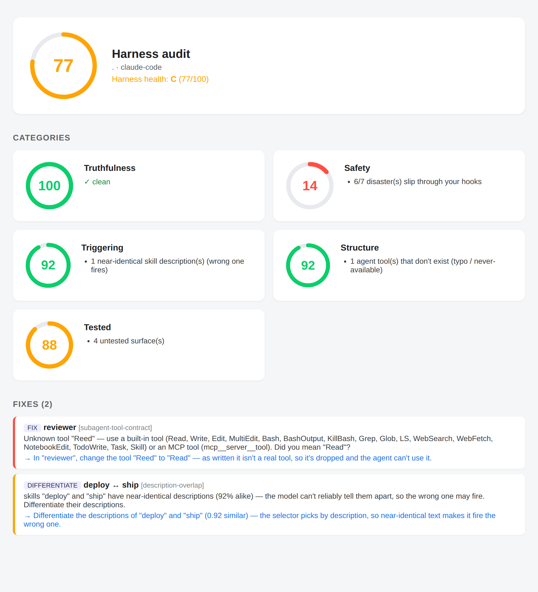

<!--
  README DIRECTION — read before editing; keep changes aligned.
  This file is the FRONT DOOR + a marketing asset for someone who already lives
  in Claude Code / Codex. Optimize for a phone-skimmer.

  1. LEAD WITH BENEFITS, not mechanics or vocabulary. Say what the user GETS
     (a guard that can't silently fail; a CLAUDE.md that stops lying) before how.
  1b. NEVER OPEN WITH A NEGATIVE, APOLOGY, OR CAVEAT. A bolded lead-in is the
     FIRST thing a skimmer reads, so it must be the benefit/on-ramp, never a
     deficiency or competitor: write "Start in plain markdown", NOT "No
     TypeScript?". Put the STRONGEST proof (e.g. 2/7→7/7) on its OWN line, never
     buried mid-paragraph, and END a section on the win, not the caveat (demote
     trade-offs to a trailing aside). Break run-on em-dash/semicolon chains — a
     paragraph is ≤ ~3 lines, one idea.
  1c. LEAD WITH THE CONCRETE PAIN the reader already feels — named in THEIR
     situation, with the SPECIFIC silent failure, not an abstraction. "You
     installed plugins and wrote skills — but do they actually work? A skill that
     never fires, a hook that blocks nothing, a CLAUDE.md full of dead refs" beats
     "reliability for your harness"; "a library with no tests" is the anchoring
     analogy. This is NOT a 1b violation: a pain about the READER's situation is a
     hook, not an apology — 1b bans opening with vigiles's OWN deficiency, a
     caveat, or a competitor, never the user's pain. SAME FOR THE SUBDOCS: open
     every guide with the concrete pain, THEN the "what this doc is" line + the
     README uplink (per docs-quality in CLAUDE.md).
  2. SPEC-FIRST IS THE DEFAULT — but easy, never intimidating. `init` adopts your
     existing CLAUDE.md INTO a spec, and model-invocable skills (edit-spec /
     strengthen / test-harness) author + edit it, so you rarely hand-write a
     .spec.ts and hooks auto-compile on save. Present the typed spec as the default
     the agent manages for you, NOT an advanced opt-in or a "step up". Inline
     markdown is the ZERO-TS FLOOR for anyone who skips `init` (progressive
     adoption) — the on-ramp, not the default starting point. `eject` always
     reverses. NEVER a wall.
  3. THE INSTRUMENTS stay first-class — including Eval (measuring whether a skill
     actually helps is core, not optional). NOTE: Guard / compiled hooks is PARKED
     FOR LAUNCH (commented out below; see research/roadmap.md "Launch readiness") —
     so the live set is Lint/Test/Eval ("three instruments"); re-add Guard post-HN.
  4. SCANNABLE + SHORT — ~200-line cap; punchy table cells, bullets, runnable
     blocks; benefits over jargon. Push depth into docs/ and LINK it.
  5. NO INTERNAL VOCABULARY (moat / measurement-authority / flywheel) and NO
     research/ links — name the user benefit (see public-vs-internal-docs +
     readme-brevity in CLAUDE.md).
-->

<p align="center">
  
</p>

<h1 align="center">vigiles</h1>

<p align="center">
  <strong>Make the harness your AI agent runs on reliable.</strong>
</p>

<p align="center">
  <a href="https://www.npmjs.com/package/vigiles"></a>
  <a href="https://github.com/zernie/vigiles/actions"></a>
  <a href="https://github.com/zernie/vigiles/blob/main/LICENSE"></a>
</p>

---

**You installed a bunch of plugins and wrote a few skills — but do they actually work?**
A skill that never fires, a safety hook that blocks nothing, a CLAUDE.md full of dead
references — your harness fails **silently**, and you find out mid-task.

**It's a library with no tests.**

**One command shows you — like a Lighthouse report for your harness:**

```bash
npx vigiles audit          # no key, no config, safe to run anywhere
```

It **runs** your harness — fires your safety hooks against a real disaster battery,
not just reads them — scores five categories, and writes a shareable HTML report:

<p align="center">
  
</p>

| Ring                | What it proves                                                        |
| ------------------- | --------------------------------------------------------------------- |
| **🔎 Truthfulness** | Every path / script / symbol / linter rule in your CLAUDE.md resolves |
| **🛡 Safety**       | Your hooks actually **block** the dangerous thing — _we run them_     |
| **🎯 Triggering**   | Skills fire on the right prompts and don't collide                    |
| **🔧 Structure**    | Tool contracts, MCP servers & frontmatter are sound                   |
| **🧪 Tested**       | Every surface ships a test                                            |

Live MCP resolution runs by default on your own repo; **do your skills actually
fire?** is measured on your own subscription — offered by default, asked once
(`--measure` to force, `--fast` to skip). **[Audit a harness →](docs/for-plugin-authors.md)**

`Agent = Model + Harness` — the model gets the headlines, the harness is the half you
own. vigiles[^name] is how you make it prove itself: `audit` is the dashboard, and
**three instruments** fix and prove what it finds —

|             |                                                                                                                                                 |
| ----------- | ----------------------------------------------------------------------------------------------------------------------------------------------- |
| **🔎 Lint** | Your CLAUDE.md stops lying — every path, script, symbol & linter rule checked against **reality**. **[→](docs/verifying-instruction-files.md)** |
| **🧪 Test** | Prove your hooks, skills & subagents do their job — **free, no API key**. **[→](docs/harness-testing.md)**                                      |
| **📊 Eval** | Know if a skill helps or just costs — **A/B on real tasks**, on your own subscription. **[→](docs/measuring-skills.md)**                        |

<!-- PARKED FOR LAUNCH — Guard / compiled hooks. Re-add this row + the ④ section below post-HN. See research/roadmap.md "Launch readiness".
| **🛡 Guard** | A safety hook that **can't silently fail open** — write a typed function, get a guard that blocks. **[→](docs/compiled-hooks.md)** |
-->

**Two ways in** — pick the pain that's yours:

- **Run agents on your own repo?** `npx vigiles audit`, then `npx vigiles init`.
- **Ship plugins to a marketplace?** `npx vigiles audit ./plugins/*/` ranks a whole
  marketplace (0–100, A–F) — see the **[plugin-author guide →](docs/for-plugin-authors.md)**.

**Your agent writes the spec — and you can always eject.** Skills author the
`.spec.ts` for you, **`init` adopts an existing CLAUDE.md non-destructively**
(untouched until you compile), and plain markdown + inline `<!-- vigiles:enforce -->`
comments work with zero TypeScript. Works with **Claude Code and Codex**
([`vigiles/codex`](docs/harnesses.md)) or [your own harness](docs/authoring-an-adapter.md).

## Quick start

**Paste into Claude Code or Codex:**

```text
Set up vigiles in this repo: run `npx vigiles init` and accept the defaults. If I
already have a CLAUDE.md or AGENTS.md, adopt it into a spec and show me which
references are stale. Then install the dep, compile, and write + run one harness
test for a hook or skill of mine. Don't enforce a spec-per-file or add a real-model
eval without asking me first.
```

The same prompt works in Codex.

Or do it yourself:

```bash
npx vigiles init   # sets up lint + test: spec + harness test + CI + plugin
```

Interactive in a terminal, non-interactive for agents/CI (or `--yes`).

**You don't hand-write any of this — your agent does.** `init` installs
model-invocable skills, so a plain-English ask does the work (it edits the source
and recompiles on save; you never touch it by hand):

- _"test my skills"_ → scaffolds **and runs** a trigger/behaviour test (`test-harness`)
- _"harden my rules"_ → upgrades prose guidance into enforced linter rules (`strengthen`)
- _"add a rule to my CLAUDE.md"_ → edits the source and recompiles (`edit-spec`)

<details>
<summary>What <code>init</code> sets up</summary>

- **Both lint and test** by default; scope with `--lint` / `--test`.
- **Already have a CLAUDE.md / AGENTS.md? `init` adopts it** into a spec faithfully and **non-destructively** — your file is left untouched until you choose to `compile` (and `eject` undoes it).
- Adds `vigiles` to `devDependencies`; installs the Claude Code plugin (skills + hooks) via the marketplace — globally, never vendored.
- Wires CI as a `zernie/vigiles@v1` workflow (a composite over the same CLI) that posts a sticky PR comment + a `valid` output.

Prefer to write tests yourself? They can be JS **or** TS
(`*.harness.{mjs,ts}`) — run them with `npx vigiles test`.

</details>

## ① Lint — your CLAUDE.md lies to your agent

**Your CLAUDE.md drifts the moment you refactor.** It points the agent at
`src/auth/login.ts` and says run `npm run check` — but the file moved six commits
ago and the script was renamed. The agent trusts the stale claim and acts on
fiction. `npx vigiles lint` resolves every reference against reality:

```text
CLAUDE.md:
  ✗ src/auth/login.ts — no such file (renamed or moved?)
  ✗ npm run check — not in package.json. Did you mean: "check:types"?
  ✓ @typescript-eslint/no-floating-promises — exists and enabled in eslint config
```

<p align="center">
  
</p>
<!-- Regenerate the GIF: `python3 scripts/make-demo-gif.py` (output is verbatim CLI; see scripts/demo.sh for a live asciinema recording). -->

File paths, scripts, code symbols — plus linter rules across **7 linters**
(ESLint, Ruff, Clippy + four more): each rule exists **and is enabled**.

**Your agent writes the spec — `init` adopts your existing CLAUDE.md into one,
faithfully and non-destructively.** Prefer zero new files? Plain markdown + one
inline `<!-- vigiles:enforce -->` comment lints too — no spec, no TypeScript. And
`vigiles eject` hands a spec back to markdown anytime.
**[Full guide →](docs/verifying-instruction-files.md)**

> **Want more? Bad states can stop compiling.** Opt in deeper and a broken
> hand-off between agents becomes a build error instead of a runtime surprise —
> graduated like TypeScript's `strict`, on only when you want it.
> **[How →](docs/compiled-hooks.md)**

## ② Test — does your harness do its job?

**You wired the hook — but does it actually block?** A skill's description can fail
to trigger, or hijack unrelated prompts; injected context can silently never reach
the model. All of it passes a naive "did it run?" check. vigiles tests the
assembled harness for real.

Start with the cheapest tier — a hook, called directly. No model, no key:

```typescript
import { runHook } from "vigiles/testing";

const r = runHook(guard, {
  hook_event_name: "PreToolUse",
  tool_name: "Bash",
  tool_input: { command: "git commit --no-verify" },
});
assert(r.blocked); // a red ✗ means your guard silently lets it through
```

It goes well past _"did it fire?"_:

- **Hooks block** what they must — `runHook`, or the real agent CLI via `runHarnessTest`.
- **Skills trigger** on the right prompts and stay quiet on the wrong ones — recall _and_ precision (`measureTriggerRate`).
- **Subagents finish right** — assert a subagent ended in the success (or error) outcome it promised, with a plain check, no LLM judge (`assertAgentOk` / `assertAgentErr`).
- **Behaviour is good** — score a skill's output, or A/B it on-vs-off for the real lift (`measure` / `runEval`, with significance testing).
- **Safety holds** — the agent _didn't_ push to the wrong branch or hit a paid API; `interceptTools` catches the attempt so the side effect never happens.

Almost every tier runs with **no model and no API key** — milliseconds, on every
commit; only the real-model tier needs a model, on your own `claude` CLI.
**[How it works →](docs/harness-testing.md)**

## ③ Eval — does it actually help, or just cost more?

**"65% fewer tokens." "3× faster." Says who?** A skill claims it, a plugin promises
it — stars and vibes, **zero measurement**. vigiles A/Bs the claim on real coding
tasks, the harness loaded exactly as it ships, and reports **three numbers**:

```typescript
import { measureArms } from "vigiles/testing";

const r = await measureArms({
  fixture: { "in.txt": "Implement a slug helper." },
  task: "Read in.txt, write slugify() to slug.js, explain. Stop.",
  arms: { baseline: {}, skill: { files: { "SKILL.md": THE_SKILL } } },
  measure: (ctx) => ({ cost: ctx.usage.costUsd, correct: check(ctx) }),
});
```

- **The bill (`costUsd`)** — weights cache ~0.1× / output 1×, so a "saved tokens" headline can't hide behind cheap cache.
- **The target** — whatever the skill claims to move (output tokens, latency, tool calls), verified on its own terms.
- **The blast radius** — correctness, a deterministic 1/0. A token win that breaks the code is **not a win**.

**Safe to repeat.** Each real-model run is sandboxed (ephemeral dir, egress blocked
or allow-listed), and `interceptTools` catches an irreversible external — a push, a
paid API — as an _attempt_, never running it. **[Safety, sandboxing & FAQ →](docs/safety.md)**

**The eval you can actually afford.** promptfoo / DeepEval hit a metered API and
bill **per token, every run**. vigiles answers most questions with **no model at
all**, and runs the rest on your own **Claude Pro/Max subscription — $0 extra**. So
you can measure on every change. **[Eval a skill →](docs/measuring-skills.md)** · **[Why it's affordable →](docs/eval-architecture.md)**

<!-- PARKED FOR LAUNCH — Guard / compiled hooks. Re-add this whole section (and the table row above) post-HN. See research/roadmap.md "Launch readiness".

## ④ Guard — a safety hook that can't silently fail open

**Your safety hook looks like it blocks — and doesn't.** A guard is your last stop
before something irreversible, but a hand-written one **fails open** without telling
you. _(Already write safety hooks? This is the power tool.)_ Write a pure typed
function instead; vigiles emits the exit code, the JSON, and an AST-backed matcher:

```typescript
import { defineHook, tool, deny, allow } from "vigiles/hook";

export default defineHook({
  on: "PreToolUse",
  match: tool("Bash"),
  decide: (e) =>
    e.command.runs("git push", { force: true })
      ? deny("no force-push to a protected branch")
      : allow(),
});
```

**The proof:** a widely-copied OSS safety hook blocks **2/7** of the disaster
battery. The compiled rewrite blocks **7/7** — measured, not asserted.

You never hand-write the exit code or JSON field (the usual false confidence), the
matcher is **AST-backed** (it catches the `cd x && git push -f` a glob misses), and
the artifact is **stamped** so a later hand-edit is refused.

_Scope: this fixes a hook's logic, not the harness's delivery — a subagent's tool
calls still bypass any PreToolUse hook
([#34692](https://github.com/anthropics/claude-code/issues/34692)), so it's a strong
default, not an unbypassable wall._
**[Compiled hooks — bug classes + trade-offs →](docs/compiled-hooks.md)**

-->

## FAQ

- **Isn't this just a markdown linter?** No — it checks whether your instruction file is _true_ (every path/script/symbol/rule exists and is enabled), then tests and measures your harness. A style linter can't do any of that.
- **Do I have to write TypeScript?** No — your agent writes the spec (`init` adopts your CLAUDE.md into one). Prefer zero new files? Plain markdown lints too. The deeper compiler-grade guarantees are the gradual, opt-in part — like TS's `strict`.
- **Does it overwrite my files?** No. `init` adopts an existing CLAUDE.md _non-destructively_ — untouched until you `compile`, and `eject` reverses it.
- **Need an API key?** No for almost everything (free, every commit). Real-model evals run on your Claude Pro/Max subscription — $0 metered tokens.
- **Non-JS repo?** `npx vigiles lint` verifies your CLAUDE.md with no install (Ruff/Clippy/Pylint/… too).

**[Full FAQ →](docs/faq.md)**

## More

- **[CLI →](docs/cli.md)** — every command and the plugin · **[GitHub Action →](docs/github-action.md)** — run it in CI. The full **[lint rules matrix →](docs/verifying-instruction-files.md#the-validation-rules--the-full-matrix)** lives with the linting guide.
- **[Skills →](docs/skills.md)** — the skills `init` installs, and how the model-invocable ones trigger.
- **[Ship plugins? The plugin-author guide →](docs/for-plugin-authors.md)** — scan a draft for structural health, make your skills fire for users, then rank a whole marketplace (0–100, A–F, worst issues first) — **no key**.
- **[Docs index →](docs/README.md)** · **[API reference →](https://zernie.github.io/vigiles/)** · **[Related tools →](docs/related-tools.md)** (ast-grep, Dependency Cruiser, Ruler, rulesync).
- **[Stability →](STABILITY.md)** — 0.x: the CLI is stable; the library API is still evolving; experimental surfaces are marked.
- **Not for you if** you want a model/capability benchmark or runtime guardrails in the request path — vigiles is build-/CI-time.
- Companion to [Feedback Loop Is All You Need](https://zernie.com/blog/feedback-loop-is-all-you-need).

## License

[MIT](LICENSE)

[^name]: **vigiles** — the watchmen of ancient Rome, who guarded the city (and fought its fires) by night. _Quis custodiet ipsos custodes?_ — "who watches the watchmen?" (Juvenal, _Satire VI_).
